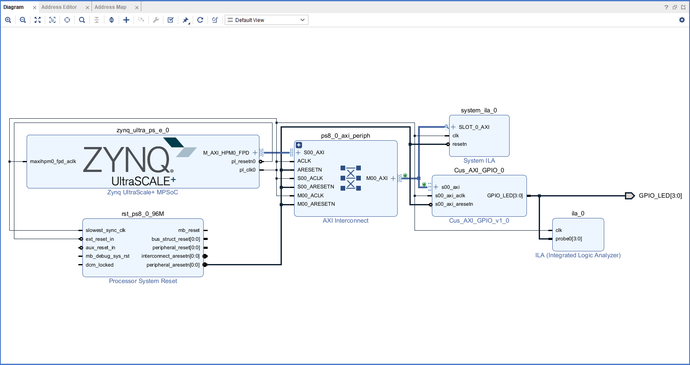

# Project 01: AXI LED Blink

### 📝 功能描述
搭建了一套ZynqMP最小系统，通过 AXI GPIO 控制 PL 端的 4-bit LED。

### 📁 目录结构 (Structure)
* `hw_export/`: 硬件导出描述文件 (.xsa)
* `src/`: 硬件 HDL 源码及约束 (HDL, XDC)
* `vitis/src/`: 嵌入式 C 源码 (led 逻辑)
* `host/`: Python 上位机控制脚本
* `scripts/`: Vivado 工程重建 Tcl 脚本

### ⚙️ 硬件架构 (Hardware Architecture)
本项目基于 Xilinx RFSoC Gen3 构建。PS 端与 PL 端的连接关系如下方的 Block Design 所示。主要的 AXI GPIO IP 用于控制 4-bit LED。

  

### 🛠 关键配置
* **AXI GPIO BaseAddr**: 0xA0000000 (请根据 Address Editor 确认)

### 🚀 重建步骤
1. **Hardware**: 在 Vivado 中 `source scripts/rebuild_hw.tcl`。
2. **Software**: 打开 Vitis，指定 `vitis/` 为 workspace，导入 `vitis/src` 下的源码。
